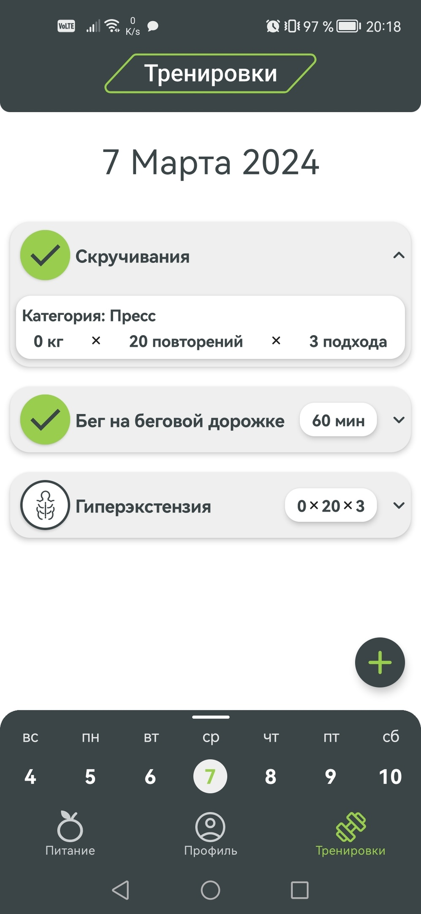

# **TrackIt**
A mobile app designed to record a workout/nutrition and track the users progress.

_Developed by 1st year students for the Project Practice_

## Tech Stack

**Development:** [Android Studio/SDK](https://developer.android.com/studio), [Kotlin](https://kotlinlang.org/), [Jetpack Compose](https://developer.android.com/jetpack/compose)

**Libraries:** [MPAndroidChart](https://github.com/PhilJay/MPAndroidChart), [Accompanist libraries](https://github.com/google/accompanist), [ComposeCalendar](https://github.com/boguszpawlowski/ComposeCalendar)

## Features

- Record training and nutrition, following from the selection in the database;
- Creating your own workouts and products
- Search for exercises by category/name and products by name.
- Displaying the compiled workouts and meals for the selected day on the main screen;
- Animated navigation between screens
- Expandable calendar with which you can select a day to display exercise/nutrition;
- Welcome screen that appears when you first log in to the app
- Record personal data in the Profile section (name, gender, weight, height, age) and display statistics (nutrition, weight, activity);
- Ability to delete cards by swipe

## Screenshots

  
  &nbsp;&nbsp;&nbsp;&nbsp;&nbsp;&nbsp;&nbsp;&nbsp;&nbsp;&nbsp;
  
  &nbsp;&nbsp;&nbsp;&nbsp;&nbsp;&nbsp;&nbsp;&nbsp;&nbsp;&nbsp;
  

  
  &nbsp;&nbsp;&nbsp;&nbsp;&nbsp;&nbsp;&nbsp;&nbsp;&nbsp;&nbsp;
  
  &nbsp;&nbsp;&nbsp;&nbsp;&nbsp;&nbsp;&nbsp;&nbsp;&nbsp;&nbsp;
  

## Installation

Install our app by downloading the [APK](https://github.com/AnTaif/TrackIt/releases/download/release/TrackIt.apk) file
    
